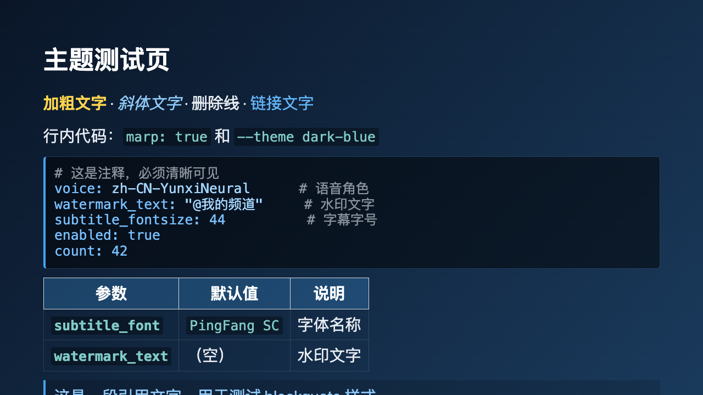
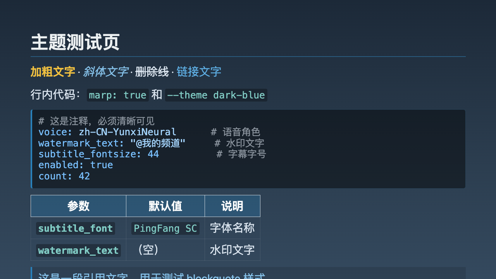
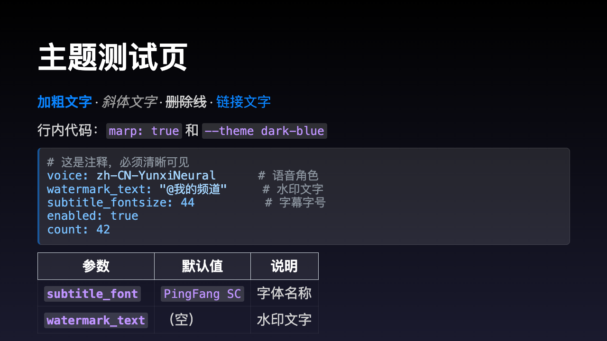
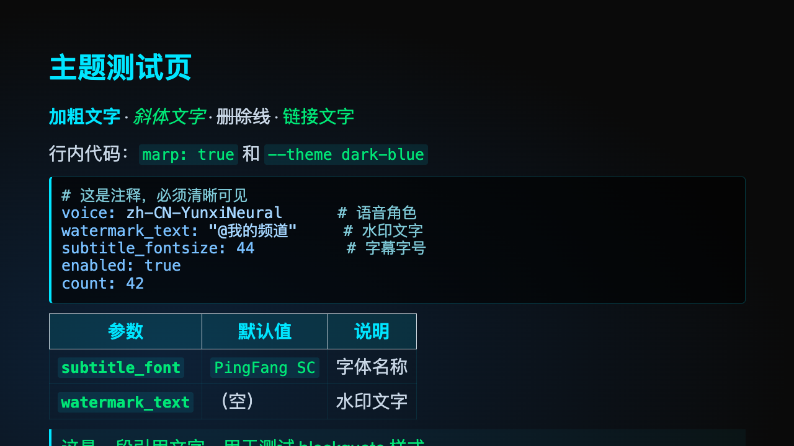
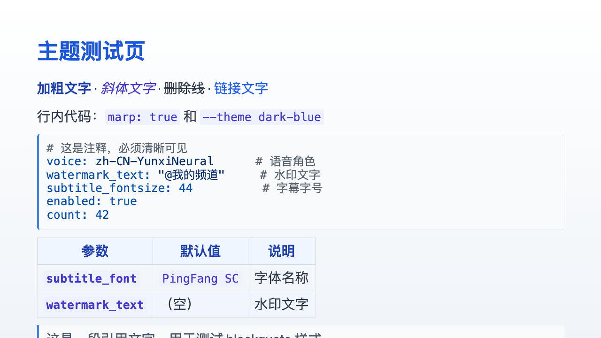
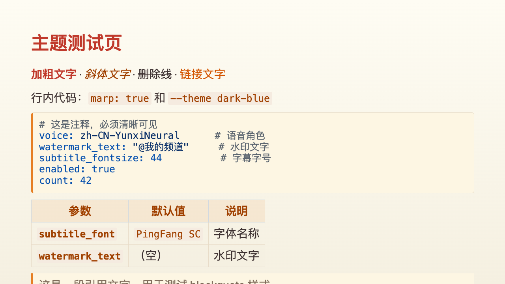
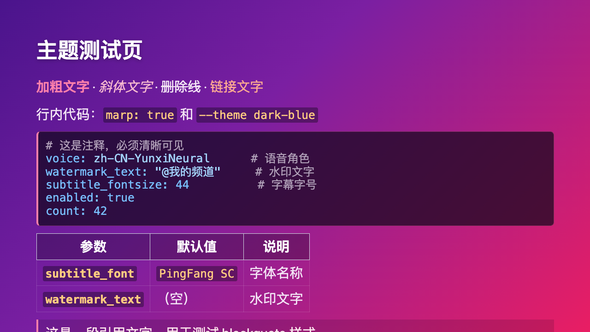
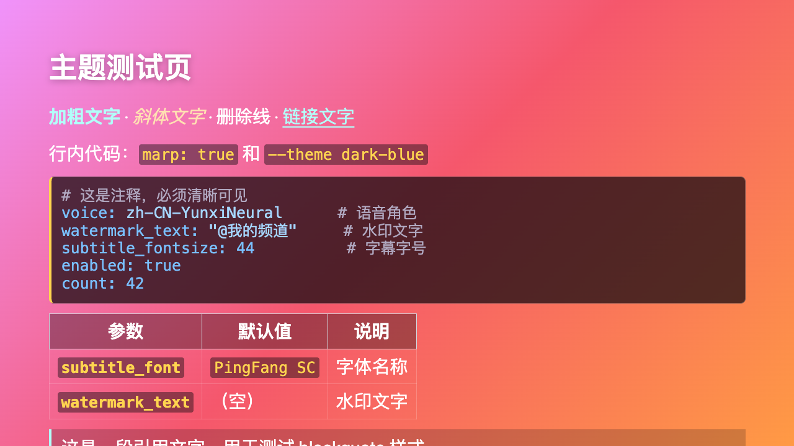
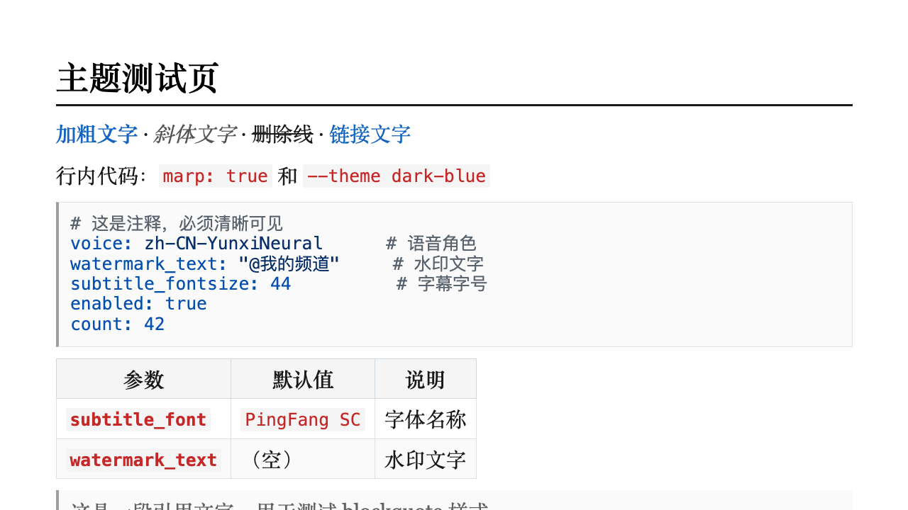
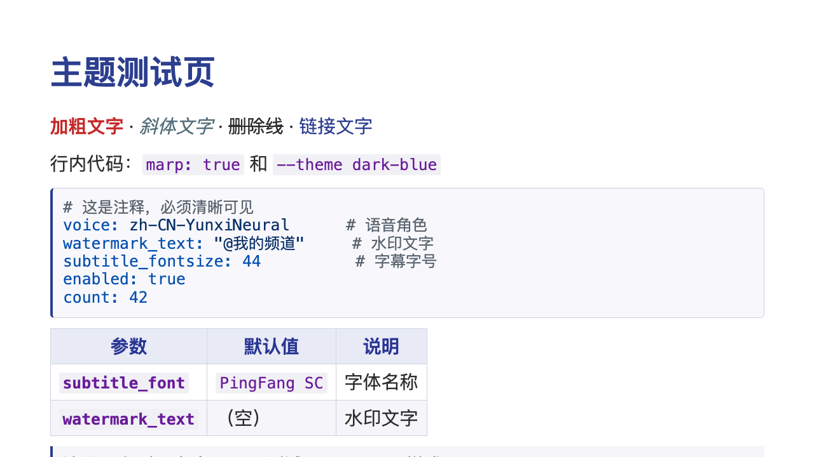

# slide2video

将 Marp Markdown 幻灯片一键转换为带语音旁白、逐句字幕和水印的教学视频。

**无需 API Key · 完全免费 · 本地运行**

## 效果预览

一个 Markdown 文件进去，一个教学视频出来：

```
presentation.md  →  slide2video  →  output.mp4 + output.srt
```

## 功能特性

- 🗣️ **语音旁白** — 基于 edge-tts（微软免费 TTS），支持中英文多种语音
- 📝 **逐句字幕** — 自动按句拆分，像电影字幕一样逐句出现，硬烧录到视频中
- 🏷️ **文字水印** — 低调水印保护内容，位置/透明度/字号均可配置
- 🎨 **10 套主题** — 覆盖商务、科技、教育、创意、学术 5 大场景
- ⚡ **一键生成** — 一条命令完成全部流程
- 🔧 **高度可配** — 字幕样式、水印、语音、分辨率均可通过 frontmatter 或命令行配置
- 🤖 **AI Skill** — 可作为 Kiro / Claude 等 AI agent 的 skill 使用

## 快速开始

### 1. 安装依赖

```bash
brew install ffmpeg
npm install -g @marp-team/marp-cli
pip install edge-tts
```

### 2. 编写 Markdown

```markdown
---
marp: true
voice: zh-CN-YunxiNeural
watermark_text: "@MyChannel"
---

# 第一页标题

- 要点内容

::: notes
这里写讲解旁白，不会显示在幻灯片上。
会被转成语音和逐句字幕。
:::

---

# 第二页

更多内容...

::: notes
第二页的讲解旁白。
:::
```

### 3. 一键生成视频

```bash
python3 scripts/run.py your_slides.md -o output.mp4 --theme dark-blue
```

就这么简单。

## 内置主题

10 套经典主题，通过 `--theme` 参数一键切换：

| 系列 | 主题 | 预览 |
|------|------|------|
| 🏢 商务 | `dark-blue` |  |
| 🏢 商务 | `steel-blue` |  |
| 💻 科技 | `dark-keynote` |  |
| 💻 科技 | `cyber-dark` |  |
| 📚 教育 | `clean-white` |  |
| 📚 教育 | `warm-sand` |  |
| 🎨 创意 | `gradient-purple` |  |
| 🎨 创意 | `sunset-gradient` |  |
| 🎓 学术 | `minimal-academic` |  |
| 🎓 学术 | `latex-beamer` |  |

也可以使用自定义 CSS 文件：`--theme /path/to/custom.css`

## 命令行参数

```bash
python3 scripts/run.py <input.md> [options]
```

| 参数 | 说明 | 默认值 |
|------|------|--------|
| `-o` | 输出视频路径 | `<input_name>.mp4` |
| `--theme` | 主题名或 CSS 路径 | default |
| `--voice` | TTS 语音 | `zh-CN-YunxiNeural` |
| `--watermark` | 水印文字 | （无） |
| `--wm-opacity` | 水印透明度 | `0.15` |
| `--wm-position` | 水印位置 | `top_right` |
| `--resolution` | 视频分辨率 | `1920:1080` |
| `--fps` | 帧率 | `30` |
| `--no-subtitle` | 不烧录硬字幕 | |
| `--keep-temp` | 保留中间文件 | |

## Frontmatter 配置

在 Markdown 文件头部配置参数，所有参数可选：

```yaml
---
marp: true
theme: default
voice: zh-CN-YunxiNeural
silence_duration: 3
watermark_text: "@MyChannel"
watermark_opacity: 0.15
watermark_position: top_right
subtitle_fontsize: 48
subtitle_color: "&H20FFFFFF"
subtitle_outline: 2
---
```

配置优先级：`代码默认值 → frontmatter → 命令行参数`

## 可用语音

| Voice | 性别 | 风格 | 语言 |
|-------|------|------|------|
| `zh-CN-YunxiNeural` | 男 | 自然叙述 | 🇨🇳 中文 |
| `zh-CN-XiaoxiaoNeural` | 女 | 温暖亲切 | 🇨🇳 中文 |
| `zh-CN-YunjianNeural` | 男 | 新闻播报 | 🇨🇳 中文 |
| `en-US-GuyNeural` | 男 | 自然 | 🇺🇸 英文 |
| `en-US-JennyNeural` | 女 | 自然 | 🇺🇸 英文 |

## 工作原理

```
input.md → prepare.py → notes.json + clean.md
                              ↓              ↓
                    generate_audio.py    marp --images
                              ↓              ↓
                         audio/*.mp3    slides/*.png
                              ↓              ↓
                         compose_video.py (+ subtitle.py)
                              ↓
                    output.mp4 + output.srt
```

每个脚本独立可用，支持分步调试：

```bash
# Step 1: 预处理
python3 scripts/prepare.py input.md -o notes.json

# Step 2: 渲染幻灯片
marp --theme themes/dark-blue.css --images png input_clean.md -o slides/slide.png

# Step 3: 生成语音
python3 scripts/generate_audio.py notes.json -o audio/

# Step 4: 合成视频
python3 scripts/compose_video.py slides/ audio/ -o output.mp4 --notes notes.json
```

## 作为 AI Skill 使用

将整个目录拷贝到你的 agent skills 目录下：

| Agent | 路径 |
|-------|------|
| Kiro | `.kiro/skills/slide2video/` |
| Claude | `.claude/skills/slide2video/` |
| 其他 | 按该 agent 的 skill 规范放置 |

agent 会读取 `SKILL.md` 获取执行指引，用户只需说"帮我生成视频"即可触发。

## 项目结构

```
slide2video/
├── README.md              ← 本文件
├── SKILL.md               ← AI Skill 入口（面向 agent）
├── LICENSE                ← MIT 协议
├── requirements.txt       ← Python 依赖
├── scripts/
│   ├── run.py             ← 一键 pipeline
│   ├── prepare.py         ← 预处理：解析 notes + 生成 clean .md
│   ├── generate_audio.py  ← edge-tts 语音合成
│   ├── compose_video.py   ← ffmpeg 视频合成 + 字幕 + 水印
│   ├── subtitle.py        ← 字幕生成（SRT/ASS）
│   └── config.py          ← 集中配置
├── themes/                ← 10 套 Marp CSS 主题
└── example/
    ├── demo.md            ← 快速上手示例
    ├── guide.md           ← 完整使用指南（18 页）
    └── theme_preview/     ← 主题预览图
```

## 限制

- 需要网络连接（edge-tts 依赖微软在线 TTS 服务）
- 字幕时间轴按字数比例分配，非精确语音对齐
- 页间硬切，无过渡动画
- 不支持同一文件内不同页使用不同语音

## License

[MIT](LICENSE)
